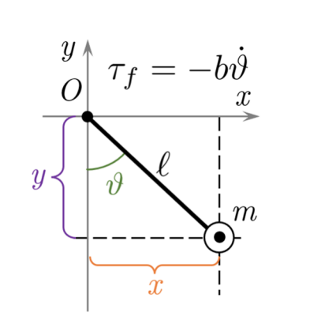

# Lab of Rational Mechanics

Welcome to the GitHub repository for the course "Lab of Rational Mechanics"! This repository contains all the files related to my work as a student in the course.

## Course Description

In the "Lab of Rational Mechanics" course, we covered the fundamental topics of rational mechanics. Alongside theoretical discussions, we focused on practical simulations using MATLAB. We went beyond simply deriving equations of motion and explored the numerical simulation of systems.

## Folder Structure

This repository is organized into the following folders:

1. **Dumped-pendulum:** This folder contains the files and functions related to the dumped pendulum. The system is a classical pendulum dumped with a viscous friction force. 

2. **Inverted-pendulum:** Here, you can find the files and functions for the Inverted pendulum.

3. **Double-pendulum:** This folder consists of the files and functions for the Double pendulum. Particulary focused on the chaotic behavior of the system

4. **Centrifugal-governor:** Here, you will find the files and functions for the Centrifugal governor. 

5. **2Dof-Robot:** This folder contains the files and functions for the 2 Degree of freedom robot and an actuated inverted double pendulum . 

## Getting Started

To access my work for each assignment, navigate to the respective folder and explore the files inside. You will find the MATLAB functions that model the systems and the files where I conducted the analysis. Feel free to review the code and the results to gain insight into the simulations performed.

Please note that the files in this repository are specific to my work as a student, and they may not cover all aspects of the course. If you have any questions or would like to see additional information, please feel free to reach out to me.

Thank you for your attention, and I hope you find my work in the "Lab of Rational Mechanics" course informative and insightful!
